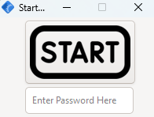
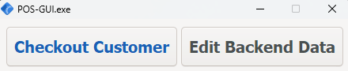
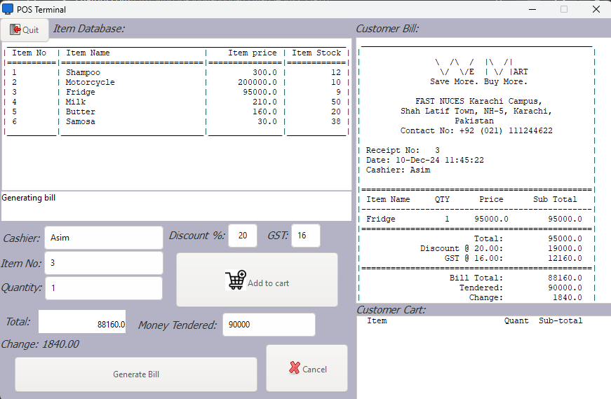
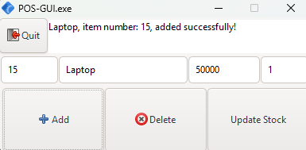

# POS-GUI: A Point of Sale System

Welcome to **POS-GUI**, a simple point-of-sale system I built during my first semester as a Programming Fundamentals (PF) project. This project holds a special place for me because it was one of the first times I built a functional GUI application from scratch. It’s not perfect, but I’m proud of what I achieved here.

## Features
- **Cashier Login**: A simple password screen to access the system.
- **Customer Checkout**: Add items to the cart, calculate totals, apply discounts, and generate receipts.
- **Inventory Management:** Modify stock data in the csv file directly from the app.
- **Receipt Generation**: Automatically saves a text-based receipt for each transaction.
- **User Interface:** A graphical interface built with GTK3 and Glade, making it simple to use.

## Screenshots
### 1. Initial Password Screen
*Description*: The first screen asks the cashier to log in with a password to access the POS system.



### 2. Selection Screen
*Description*: Choose between two options: checking out customers or editing the backend data (items and prices).



### 3. Checkout Screen
*Description*: Add items to the cart, apply discounts, calculate totals, and generate receipts for customers.



### 4. Edit Backend Data
*Description*: Edit the item database stored in a CSV file directly from the application.



## Prebuilt Version
For a ready-to-run Windows build, download the **[POS_GUI_Windows_Build.zip](POS_GUI_Windows_Build.zip)** file in the repository. It includes the executable, required DLLs, and Glade/assets files. Simply extract and run.

## Project Structure
```
.
├── POS-GUI.c                 # Source code
├── assets/                   # Assets for the project (Glade file, images)
│   ├── builder.glade
│   ├── download.png
│   └── start.png
├── screenshots/
│   ├── initial_password_screen.png
│   ├── main_menu_screen.png
│   ├── checkout_customer_screen.png
│   └── edit_data_screen.png
├── POS Data.csv              # Stock data
├── POS_GUI_Windows_Build.zip # Prebuilt version for Windows
└── README.md
```

## How to Compile
If you’re familiar with GTK3, you can compile this project on your own system (runs best on windows), you will need:
- **POS-GUI.c**: The main program file.
- **Assets folder**: Contains the `builder.glade` file and necessary images.

1. Make sure you have GTK3 installed.
2. Place the contents of the `assets/` folder in the same directory as `POS-GUI.c`.
3. Compile using the following command:
   ```gcc POS-GUI.c -o POS-GUI pkg-config --cflags --libs gtk+-3.0```
4. Run the application:
   ```./POS-GUI```

## Notes
- The application was developed for **Windows** and tested using **MSYS2**.
- This was my first attempt at creating a GUI application, and it may not be perfect, but it holds significant sentimental value.

Thank you for checking out my first-ever GUI project! 😊